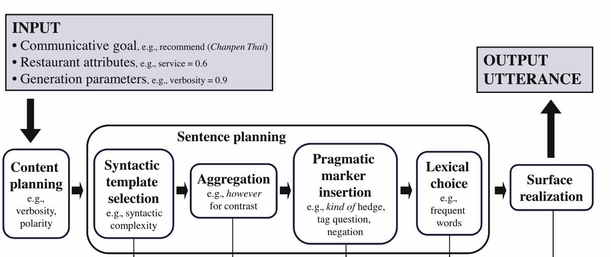

# Organization of the *Personage* demo

This demo illustrates how to customize the `jsRealB` realizer to vary the linguistic style of the generated text according to a user profile defined as one of the _Big Five_ model of personality. This idea was originally developed in a series of models by François Mairesse and Marylin Walker between 2007 and 2011 [1,2,3,4] to adapt utterances in a dialog context:
* PERSONAGE-RB a rule-based text generator for which the parameters were handcrafted;
* PERSONAGE-OS based on a statistical rescoring model to rank randomly gnerated utterances;
* PERSONAGE-PE whose generation parameters are determined by training parameter estimation models.

In this demo, we adapt the rule-based approach.  

Their system was developed in Java to create Deep Syntactic Structures as defined in Meaning-Text Theory which were then realized with RealPro[5]. The goal of this demo it to show how to reproduce the essential steps of this architecture with `jsRealb` showing some of the advantages of single programming language for the whole realization process.

Mairesse presents the architecture of the system by the following figure (taken from Figure 1 of [4, p. 461]).

described as follows
>"The content planner specifies the structure of the information to be conveyed. The resulting content plan tree is then processed by the sentence planner, which selects syntactic templates for expressing individual propositions, and aggregates them to produce the utterance’s full syntactic structure. The pragmatic marker insertion component then modifies the syntactic structure locally to produce various pragmatic effects, depending on the markers’ insertion constraints. The lexical choice component selects the most appropriate lexeme for each content word, given the lexical selection parameters. Finally, the RealPro surface realizer converts the final syntactic structure into a string by applying surface grammatical rules, such as morphological inflection and function word insertion."`

# References
[1] François Mairesse. Learning to Adapt in Dialogue Systems: Data-driven Models for Personality Recognition and Generation. Ph.D. thesis, University of Sheffield, Department of Computer Science, 2008. 

[2] François Mairesse and Marilyn Walker. PERSONAGE: Personality Generation for Dialogue. In Proceedings of the 45th Annual Meeting of the Association for Computational Linguistics (ACL), Prague, June 2007. 

[3] François Mairesse and Marilyn Walker. Trainable Generation of Big-Five Personality Styles through Data-driven Parameter Estimation. In Proceedings of the 46th Annual Meeting of the Association for Computational Linguistics (ACL), Columbus, June 2008. 

[4] François Mairesse and Marilyn Walker. Controlling User Perceptions of Linguistic Style: Trainable Generation of Personality Traits. Computational Linguistics, 37(3), 2011. 

[5] Benoit Lavoie and Owen Rambow. A fast and portable realizer for text generation systems.
In Proceedings of the 5th. Conference on Applied Natural Language Processing, pages 265--268, Washington, D.C., 1997. Association for Computational Linguistics.

